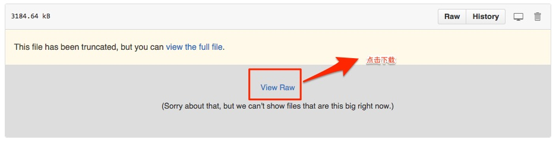

### 个人分享相关的PPT，方便大家下载

点击单个链接进入下载界面，然后点击如下图[View Raw]即可下载。

+ [2015年7月18日oschina杭州分享：React-Native开发原生iOSApp@王利华.ppt](https://github.com/vczero/sharePPT/blob/master/2015%E5%B9%B47%E6%9C%8818%E6%97%A5oschina%20%E6%9D%AD%E5%B7%9E%E5%88%86%E4%BA%AB%20React-Native%E5%BC%80%E5%8F%91%E5%8E%9F%E7%94%9FiOSApp%E6%90%BA%E7%A8%8Bvczero.ppt)     
   相关链接：https://github.com/vczero/react-native-lession       
   实例App：https://github.com/vczero/React-Native-App      

+ [2015年8月20日非正式前端交流会UI组件最佳实现探索@框架王利华.pptx](https://github.com/vczero/sharePPT/blob/master/2015%E5%B9%B48%E6%9C%8820%E6%97%A5%E9%9D%9E%E6%AD%A3%E5%BC%8F%E5%89%8D%E7%AB%AF%E4%BA%A4%E6%B5%81%E4%BC%9AUI%E7%BB%84%E4%BB%B6%E6%9C%80%E4%BD%B3%E5%AE%9E%E7%8E%B0%E6%8E%A2%E7%B4%A2%40%E6%A1%86%E6%9E%B6%E7%8E%8B%E5%88%A9%E5%8D%8E.pptx)      

+ [2015年9月2号携程内部培训HTML5系列教程之HTML5知识体系@王利华]()

    

